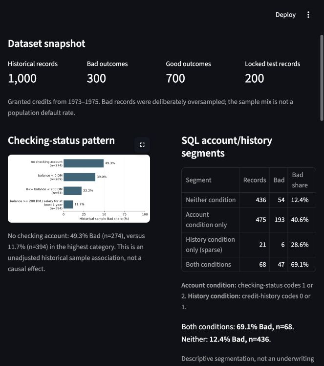
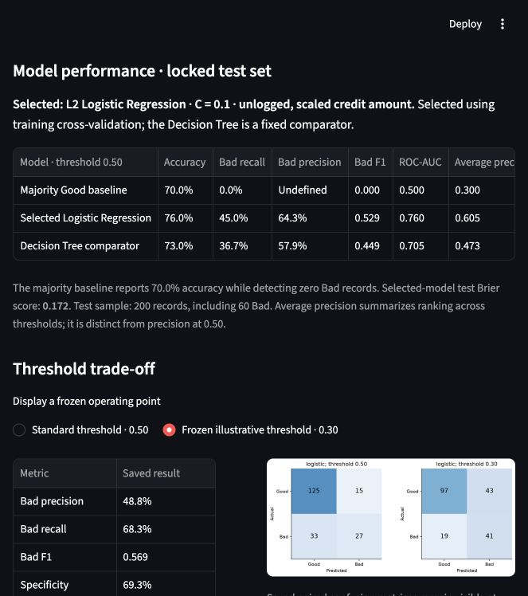
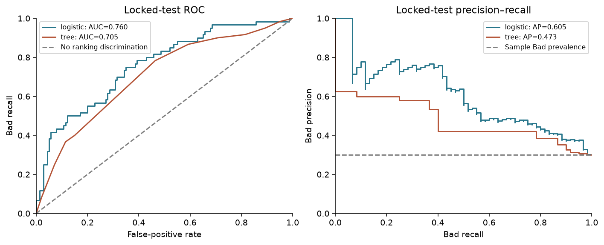

# Credit risk analytics

This project explores credit risk using the South German Credit dataset. Cleaning, focused EDA, SQL analysis, predictive modeling, and the Streamlit presentation are complete. This is a historical analytical portfolio project, not a production underwriting system.

## Dashboard

The [Streamlit case study](dashboard/README.md) presents saved account patterns, SQL segments, model performance, two frozen threshold trade-offs, and three modeled associations. It reads existing artifacts without running analysis or scoring applicants. Source **credit_risk = 0 means Bad / 1 means Good**; modeling uses **is_bad = 1 for Bad**.

From the repository root, with a Python environment activated:

```bash
python -m pip install -r dashboard/requirements.txt
python -m streamlit run dashboard/app.py --browser.gatherUsageStats false
```

**Live dashboard:** [Open the Credit Risk Analytics Dashboard](https://credit-risk-analytics-cvbzwyzs9h6wx9zay23tm6.streamlit.app/)\n\nLocal launch and browser rendering were verified. The public Streamlit deployment is available at the link above. See the dashboard README for an isolated environment and artifact requirements.





**Architecture:** Raw data → Python cleaning → EDA → SQLite / SQL analysis → Logistic Regression modeling → read-only Streamlit analytical dashboard.

## Repository structure

```text
data/
  raw/SouthGermanCredit.asc              Original source data
  processed/south_german_credit_clean.csv Validated cleaned export
  database/south_german_credit.sqlite     Generated SQLite database (Git-ignored)
notebooks/
  01_data_cleaning.ipynb                 Implemented cleaning workflow
  02_exploratory_analysis.ipynb          Implemented focused EDA
  03_predictive_modeling.ipynb           Interpretable classification analysis
src/                                    Reserved for reusable Python code
sql/                                    SQLite schema, loader, queries, and CSV results
reports/modeling/                       Modeling split, metrics, and interpretation tables
images/modeling/                        Four modeling figures
images/dashboard/                       Captured dashboard screenshots
dashboard/                              Read-only Streamlit app, dependencies and launch guide
requirements.txt                        Current runtime dependencies
```

The empty reserved directories may not appear in a fresh Git clone. The local `.venv/` environment is ignored and must be created separately.

## Dataset source

Source: [South German Credit, UCI Machine Learning Repository](https://www.archive.ics.uci.edu/dataset/573/south%2Bgerman%2Bcredit%2Bupdate).

Citation: South German Credit [Dataset]. (2020). UCI Machine Learning Repository. https://doi.org/10.24432/C5QG88.

The dataset is distributed under [Creative Commons Attribution 4.0](https://creativecommons.org/licenses/by/4.0/). Consult UCI's accompanying `codetable.txt` and `read_SouthGermanCredit.R` for category definitions; these reference files are not currently bundled here. Use the corrected South German documentation rather than the older Statlog German Credit code table.

The supplied source has 1,000 records, 20 predictors, and one target. The processed CSV has 22 columns because it adds a readable target label.

## Setup and execution

Python **3.14** is recommended; the cleaning workflow was verified with the existing Python 3.14 environment. Pandas, matplotlib, scikit-learn, and the Jupyter Notebook application are declared as direct dependencies. NumPy is provided through the scientific Python dependencies. Notebook installs its required kernel and execution infrastructure transitively.

From the repository root:

```bash
python3.14 -m venv .venv
source .venv/bin/activate
python -m pip install -r requirements.txt
python -m notebook
```

Open `notebooks/01_data_cleaning.ipynb`, select the environment's Python kernel, and restart the kernel and run all cells. Outputs are retained for reading on GitHub. Execution regenerates `data/processed/south_german_credit_clean.csv`.

The notebook finds the checkout by searching the current directory and its parents, so it works from the repository root, `notebooks/`, or another directory within the checkout. When launching a kernel outside the checkout, set an explicit root before starting Jupyter:

```bash
export CREDIT_RISK_PROJECT_ROOT="/absolute/path/to/credit-risk-analytics"
python -m notebook
```

For noninteractive execution, from the repository root with the environment activated:

```bash
python -m nbconvert --to notebook --execute --inplace notebooks/01_data_cleaning.ipynb
```

## Cleaning workflow

1. Locate the checkout and read the whitespace-delimited raw file.
2. Validate the exact raw column set and rename German columns to readable English names; verify the resulting names and order.
3. Validate the target and add `credit_risk_label`.
4. Reject missing labels or missing values anywhere in the final dataset.
5. Inspect a sample, quantitative summaries, category frequencies, and duplicate counts.
6. Validate again before export, create the processed directory if needed, and save without a dataframe index.

Cleaning does not sort, filter, impute, recode original values, or remove records. The supplied dataset contains no missing values or duplicate rows. Duplicate counts are reported rather than automatically removed.

### Variable semantics

| Group | Columns |
|---|---|
| Quantitative | `duration_months`, `credit_amount`, `age` |
| Ordinal | `employment_duration`, `installment_rate`, `residence_duration`, `property`, `number_credits`, `job` |
| Nominal | `checking_status`, `credit_history`, `purpose`, `savings`, `personal_status_sex`, `other_debtors`, `other_installment_plans`, `housing` |
| Binary/target | `people_liable`, `telephone`, `foreign_worker`, `credit_risk`, `credit_risk_label` |

These groups describe meaning; the underlying stored values remain unchanged. Ordinal and binary category codes must not be assumed to be literal measurements or exact counts.

### Target definition

- `credit_risk = 1`: Good credit; `credit_risk_label = "Good"`.
- `credit_risk = 0`: Bad credit; `credit_risk_label = "Bad"`.

There are 700 Good and 300 Bad records. Future models must exclude both target columns from predictors. With this encoding, a probability for class 1 represents Good credit, not default risk.

## Important limitations

- Records date from 1973–1975 and do not represent contemporary lending conditions.
- Bad credits were deliberately oversampled. The observed 30% Bad share is not a population default-rate estimate.
- Credit amounts are transformed historical DM values; the actual original amounts and transformation are unknown.
- Several variables encode ranges or categories rather than direct measurements. Means and correlations of nominal codes can be misleading.
- Sex cannot reliably be recovered from the combined `personal_status_sex` category. Demographic interpretations require care.
- Row order is strongly associated with the target: the final 200 records are all Bad. Future train/test splits should be shuffled and stratified, with a fixed random seed.
- The readable label is derived directly from the target and would cause leakage if used as a predictor.

These limitations come from the UCI dataset documentation and inspection of the supplied files. This repository is an exploratory learning project, not a validated lending decision system.

## Project status

- Cleaning: complete.
- EDA: complete, with descriptive tables and four figures.
- SQL analysis: complete, with ten reproducible reports.
- Predictive modeling: complete (Logistic Regression and shallow Decision Tree).
- Dashboard/visualization: complete (read-only Streamlit case study; verified locally).

The analytical portfolio workflow is complete, including its Streamlit presentation. Open `notebooks/02_exploratory_analysis.ipynb` and run all cells after cleaning; it reads the processed CSV without modifying it. EDA contains descriptive tables and four figures, with no modeling.


## SQL analysis

SQLite adds concentration reporting, overlapping account/history segments, and record drilldowns to the Python EDA. It uses one source table (`credit_records`), one corrected-label table (`category_lookup`), and a reporting view (`credit_reporting`). Technical `record_id` values preserve one-based CSV row positions; they are not customer IDs. All cleaned source values are retained.

Use Python's standard-library SQLite module (SQLite >=3.37; no extra packages). From the repository root:

```bash
python sql/load_database.py
python sql/run_analysis.py
```

The first command rebuilds and verifies the ignored database under `data/database/`. The second executes SQL and exports ordered CSV results. See [SQL documentation](sql/README.md) for root resolution, schema checks, definitions, and interpretation choices.

| Query | Business question |
|---|---|
| 01 | Does the database reconcile to the processed CSV? |
| 02 | Which longer loans meet the documented account review condition? |
| 03 | Do checking/history/savings findings match EDA? |
| 04 | Does median duration by outcome match EDA? |
| 05 | Which purposes contribute the most Bad records? |
| 06 | Where are outcomes concentrated by checking status and duration? |
| 07 | How do overlapping account/history conditions relate to outcomes? |
| 08 | How do duration composition and outcomes vary by amount quartile? |
| 09 | Which records have the largest recorded amounts within each purpose? |
| 10 | How does duration mix vary by employment category? |

### Selected executed results

Source reconciliation:

| Records | Bad | Good | Missing-value rows | Label mismatches | Missing lookup rows |
|---:|---:|---:|---:|---:|---:|
| 1,000 | 300 | 700 | 0 | 0 | 0 |

Top three purposes by Bad count:

| Purpose | Records | Bad | Bad share | Share of all Bad records |
|---|---:|---:|---:|---:|
| Others | 234 | 89 | 38.03% | 29.67% |
| Furniture/equipment | 280 | 62 | 22.14% | 20.67% |
| Car (used) | 181 | 58 | 32.04% | 19.33% |

Account/history segmentation:

| Segment | Records | Bad | Bad share | Sparse (n<30) |
|---|---:|---:|---:|---|
| Neither condition | 436 | 54 | 12.39% | No |
| Account condition only | 475 | 193 | 40.63% | No |
| History condition only | 21 | 6 | 28.57% | Yes |
| Both conditions | 68 | 47 | 69.12% | No |

Account condition means checking-status codes 1 or 2; history condition means credit-history codes 0 or 1. These are descriptive definitions, not a credit score or underwriting rule.

Three findings from the executed SQL:

- The top three purposes account for **209/300 Bad records (69.67%)**. Their within-purpose percentages differ, showing why concentration and Bad share answer different questions.
- The both-conditions segment has **69.12% Bad (47/68)** versus **12.39% (54/436)** for neither condition. The history-only segment is sparse and should not drive strong conclusions.
- The highest recorded-amount quartile has **42% Bad (105/250)** and **61.2% of records (153/250) with duration >24 months**. Amount and duration composition overlap; this does not isolate an amount effect.

Complete [queries](sql/queries/) and [result CSVs](sql/results/) are available for review. Results describe this historical oversampled sample, not population default probabilities. Transformed amounts are not used to calculate financial exposure or losses. Duration cutoffs, sparse flags, review conditions, and deterministic quartile tie handling are documented in the SQL README.


## Predictive modeling

[03_predictive_modeling.ipynb](notebooks/03_predictive_modeling.ipynb) compares L2 Logistic Regression and a shallow Decision Tree. Run all cells after installing `requirements.txt`, or execute from the repository root:

```bash
python -m nbconvert --to notebook --execute --inplace notebooks/03_predictive_modeling.ipynb
```

The notebook reads the cleaned CSV without modifying it and regenerates [modeling reports](reports/modeling/) and [four figures](images/modeling/). It uses the existing project-root discovery and `CREDIT_RISK_PROJECT_ROOT` override.

### Methodology and frozen selection

- Notebook-only target: **is_bad = 1 for Bad, 0 for Good**. Source outcome columns and all row identifiers are excluded from predictors.
- Exactly 18 predictors: quantitative scaling, full one-hot encoding of ordinal/nominal categories, and explicit binary semantic mapping. `personal_status_sex` and `foreign_worker` are excluded. No SQL review flags or outcome-derived features enter the model.
- Shuffled, stratified 80/20 split, seed 42: training has 800 records (240 Bad); test has 200 (60 Bad). Source positions are saved separately for audit.
- Five identical stratified training CV folds. Preprocessing fits inside each fold. Logistic C values 0.1/1/10 are compared for log1p versus raw-scaled amount; trees use depth 2/3/4 and minimum leaf size 20/40. No class weighting or extra model families.
- Selection uses mean average precision (AP), preferring Logistic Regression if family AP differs by at most 0.02. The selected model is **Logistic Regression, C=0.1, raw-scaled credit amount**. This representation won the approved training-only transformation comparison; it does not undo the dataset's unknown amount transformation.
- The illustrative threshold **0.30** is frozen using training out-of-fold F1. The standard reference remains 0.50. No tuning follows test evaluation.

### Training CV comparison

Best configuration per family; values are fold mean ± sample standard deviation. Variability is not a formal confidence interval, and search results are development estimates.

| Model | Configuration | Average precision | ROC-AUC | Mean Brier |
|---|---|---:|---:|---:|
| Logistic Regression | C=0.1; raw-scaled amount | 0.622 ± 0.059 | 0.784 ± 0.044 | 0.166 |
| Decision Tree | Depth=4; minimum leaf=40 | 0.466 ± 0.034 | 0.717 ± 0.024 | 0.189 |

### Locked-test performance and threshold trade-off

Bad is the positive class. Both family configurations were fixed before these results; the comparator does not change the winner.

| Model / threshold | Accuracy | Bad precision | Bad recall | Bad F1 | ROC-AUC | AP | Brier |
|---|---:|---:|---:|---:|---:|---:|---:|
| Selected logistic / 0.50 | 76.0% | 64.3% | 45.0% | 0.529 | 0.760 | 0.605 | 0.172 |
| Selected logistic / 0.30 | 69.0% | 48.8% | 68.3% | 0.569 | 0.760 | 0.605 | 0.172 |
| Fixed tree / 0.50 | 73.0% | 57.9% | 36.7% | 0.449 | 0.705 | 0.473 | 0.187 |
| Majority Good baseline | 70.0% | Undefined | 0.0% | 0.000 | 0.500 | 0.300 | 0.300 |

The constant-prior baseline also has AP 0.300 and ROC-AUC 0.500, with Brier 0.210. Majority-class accuracy hides complete failure to detect Bad outcomes.

Lowering the selected model's threshold from 0.50 to 0.30 detects **41 rather than 27 of the 60 Bad records**, while false positives increase from **15 to 43** and missed Bad records fall from **33 to 19**. Specificity falls from 89.3% to 69.3%. This demonstrates a detection trade-off, not an optimal financial policy: the dataset contains no false-positive/false-negative costs.



### Supported interpretation findings

These are regularized, conditional Logistic Regression odds-ratio contrasts, not causal effects. Training category support is included:

- No checking account versus the ≥200 DM / salary-for-at-least-one-year category: modeled Bad odds ratio **3.96**, with **217 versus 316** training records.
- Critical account/other credits elsewhere versus all credits at this bank paid duly: odds ratio **2.68**, with **42 versus 226** records.
- New-car purpose versus others: odds ratio **0.36**, with **85 versus 189** records.

Full one-hot coefficients are interpreted using `exp(beta_category − beta_reference)`, not as isolated category odds ratios. Sparse groups are excluded from the strongest-association display. A compact tree rule table describes the fitted comparator without claiming definitive impurity importance. Calibration uses five test bins of 40 records each; it is evaluated without automatic recalibration or prevalence correction.

### Methodological limits

These are historical 1973–1975 granted-credit records, with Bad outcomes deliberately oversampled and monetary values transformed. Scores, precision and calibration describe this sample—not current population default probabilities. Earlier EDA and SQL examined the full dataset, so the test partition is a modeling holdout rather than a pristine external sample. Small categories, only 60 Bad test records, model-search/OOF optimism and possible correlated predictors limit conclusions. Excluding demographic variables does not prove fairness; proxy effects remain and sex cannot be recovered reliably from `personal_status_sex`. Age remains a demographic predictor. Independent contemporary data would be needed for stronger generalization claims.

The notebook verifies that the processed CSV, cleaning/EDA notebooks, and SQL output CSVs remain unchanged. Two full executions from the repository root and `notebooks/` produced byte-identical modeling CSV/JSON/PNG artifacts. The Streamlit dashboard consumes these saved results; it does not rerun modeling or modify analytical artifacts.
